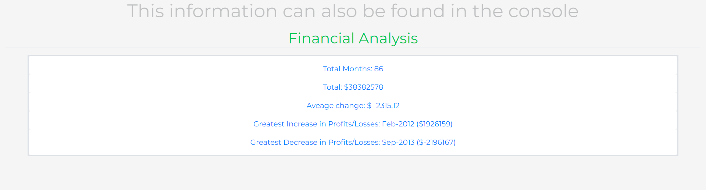
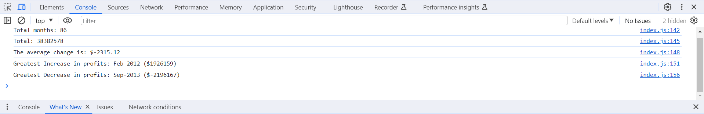

# console-finances

Simple program to find out financial information from an array

## Description

The application analyzes financial data in the form of monthly profit and loss values. It calculates and displays various insights, including the total number of months, the overall profit/loss, the average monthly change, and identifies the months with the greatest increase and decrease in profits. The code is designed to be used with an array containing financial data in the format of month-year and corresponding profit/loss values. The calculated metrics offer a quick overview of the financial trends over the specified time period.

## Installation

No installation needed

[Click here to see live copy of the site](https://lav3ll.github.io/console-finances/)

[Link to console-finances repo](https://github.com/lav3ll/console-finances)

## Usage

**Screenshot of Console:**

- At this time the javascript code would need to be manually altered to update the array to get the financials for different data.

**Website Overview:**
JavaScript code for quick financial analysis, offering insights into total months, overall profit/loss, average monthly change, and identifying peak increases and decreases. Streamline your financial analysis with this concise script using arrays.

**Key Features:**
Data analysis

**Goals and Results:**
Assist in understanding key trends in financials.

**Explore Resources:**
https://fonts.google.com/ [Main font for most of the text on site]
https://tinyjpg.com/ [Used to compress my images down]

## Credits

Skills For Life
Ed X

## License

MIT License
